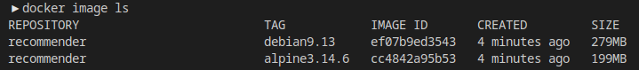
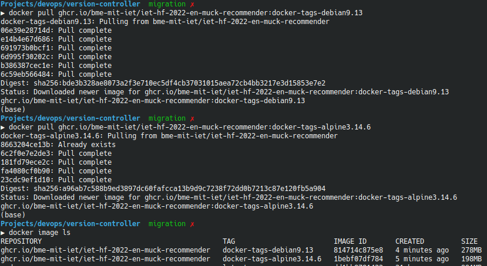

# Description

We decided to create Artifacs using Docker. The CI will build docker images and deploy them to the GitHub Packages Registry.


# Dockerfiles

The repo has two Dockerfiles in its root directory. One for the Linux Alpine Build and one for the Linux Debian Build. These two Dockerfiles are for the same Docker image, but with the corresponding tag. These images have the OS libraries and then make, gcc and g++ on top. And on the top layer we copy the files of this repository. Finaly we compile the code once

# Building The images Locally

 To make sure that the builds are of the same image, two make targets are created: `make alpine` and `make debian`. Finally, to make sure that the images are minimal, the dockerignore makes sure that the images do not have unnecessary files like compiled binaries or test results. or documentation

# Testing the build locally

to build the Alpine image locally
```bash
$ make alpine
```
to build the Debian image locally
```bash
$ make debian
```
# Build results



# Deploying the images to the registry

The CI pipeline (GitHub Actions workflow) will build the images very similarly to the local environment, except that it will tag them with the current git branch too. And then deploy them to the GitHub Packages Registry

# Deployment results



