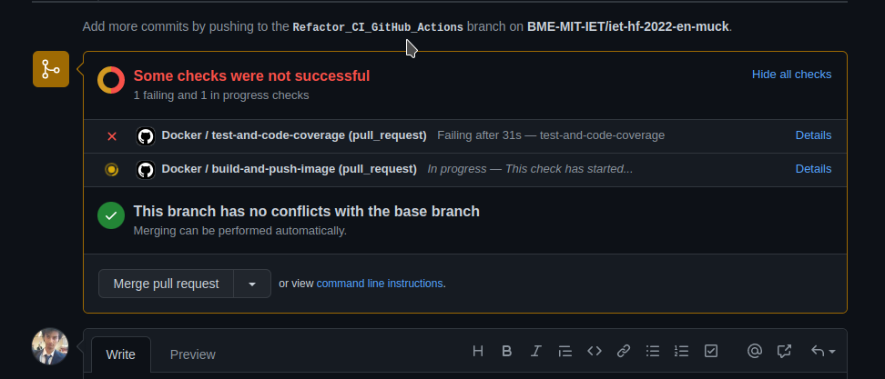

# Description

When we started working on this project, we found out that it uses an old Travis CI pipeline. We deprecated that and replaced wiht a modern tool (Github Actions).

# Refactoring the makefile

The original project uses make to build the project and a shell script to test the project, this is redundant because the make can be used to run the test.
We added the missing make targets (test, code coverage, docker image build locally)

# Refactoring the CI Pipeline

The original CI pipeline only runs the build and the tests. Our CI pipeline runs two jobs

1) It builds the projects, tests it and reports the code coverage
2) It builds the Docker images and pushes them to Github Packages

These Pipelines run in parallel and isolated from each other (on different build containers).

# Running the CI pipelines

The pipeline runs on every git push to master branch or any pull request to master branch. 

# Results

