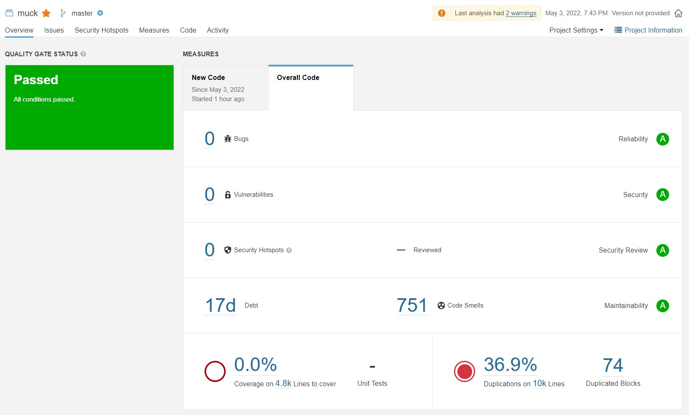
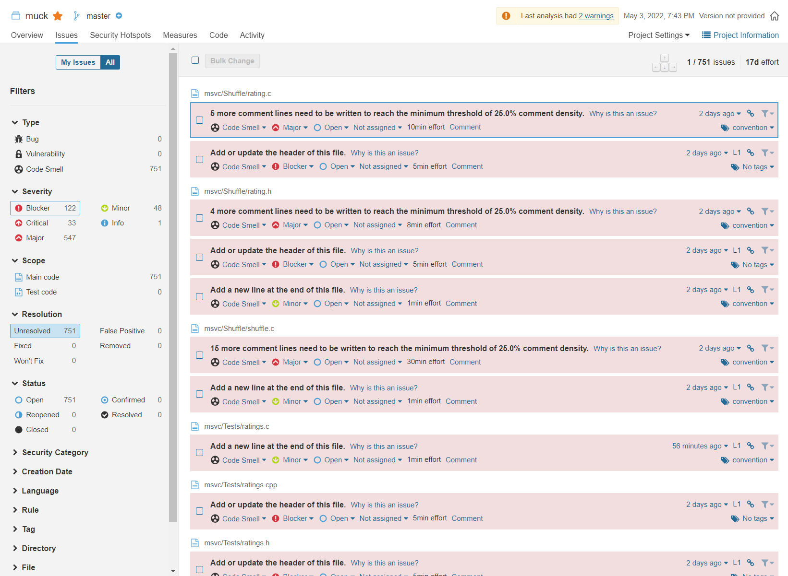
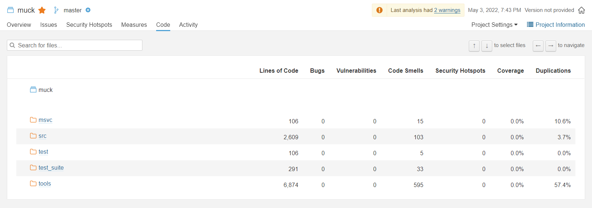

# Description

We decided to perform Static Analysis on the project using SonarQube.  This issue will detail the steps that have to be done in order to finish this task.

---

# About SonarQube

Sonar does static code analysis, which provides a detailed report of bugs, code smells, vulnerabilities, code duplications.

---

# Installing SonarQube

0. Download and install [Java 11](https://adoptium.net/releases.html?variant=openjdk11&jvmVariant=hotspot). 
Make sure the environment variables are set correctly in `PATH`. 

1. Download [SonarQube](https://www.sonarqube.org/downloads/) zip file. 
Unzip it, add the `bin` to PATH. 
Make sure you use the appropriate path depending on the OS. e.g. For Windows: `C:\sonarqube-8.9.8.54436\bin\windows-x86-64`

2. Navigate to SonarQube path and start `cmd` with admin privileges, and start SonarQube with `StartSonar` command.

3. In case of successful execution, access SonarQube local instance at `localhost:9000`. Default credentials are as following:
   > **username:** admin
   > **password:** admin

4. Choose the option to start a project locally, and copy the `projectKey` that SonarQube generates for your project.
---

# Adding SonarScanner and cxx plugin

1. Download the [sonarscanner](https://docs.sonarqube.org/latest/analysis/scan/sonarscanner/) and add the bin to `PATH`.

2.  Download the `cxx plugin` and follow the [installation steps](https://github.com/SonarOpenCommunity/sonar-cxx/wiki/Install-the-Plugin).
After that , restart SonarQube and you can see the rules of the cppcheck under **Rules** in SonarQube.

3.  We also need a new **Quality Profile** for cxx in SonarQube and add all the rules of cxx cpp checker to that **Quality Profile**. 

---

# Sonar Scanner Config

1. [Create a configuration file](https://docs.sonarqube.org/latest/analysis/scan/sonarscanner/) in your project's root directory called `sonar-project.properties`:

``` java

# must be unique in a given instance
sonar.projectKey=my:project

# mandatory: files handled by the _cxx plugin_
sonar.cxx.file.suffixes=.h,.cpp

```

---

# Running an Analysis

Run a sonar scanner analysis on your local project with following command:

```
sonar-scanner -Dsonar.login=myAuthenticationToken
```

If everything has worked, you should see an output like the one below:

```
...
17:00:53.401 INFO: Analysis total time: 3.886 s
17:00:53.404 INFO: ------------------------------------------------------------------------
17:00:53.404 INFO: EXECUTION SUCCESS
17:00:53.404 INFO: ------------------------------------------------------------------------
17:00:53.404 INFO: Total time: 5.416s
17:00:53.470 INFO: Final Memory: 23M/481M
17:00:53.471 INFO: ------------------------------------------------------------------------
```

Now head over to local SonarQube server instance and check the results generated there.

---

# Results

Once the analysis has successfully completed, we can check the results in the local server. Here's an overview of our Quality Gate Analysis:



The analysis seems to have passed since all the conditions in the Quality Gate were met, but this doesn't mean that the code doesn't have any issues. If we look a bit deeper, we can see that the code has alot of code smells on multiple levels.

Here's a small overview of these code smells under Issues:



We can also head over to **Files** tab in SonarScanner to get a better idea about which files in particular are casuing the most code smells and duplications:



---