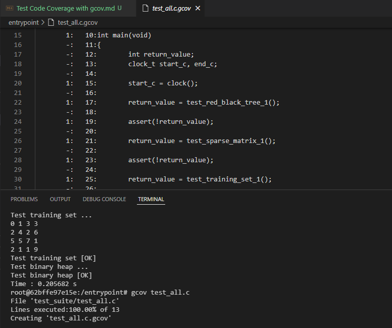

# Test Coverage

## Task Contributors
- Amani Brik
- Mehdi Moazami

## About gcov
Gcov is part of the GCC suite. There is no need to install it separately.

It's an integrated tool that helps with performing test code coverage. The next sections will specify the steps for running the gcov tool and the tests that were made by the team members.

## Steps for running gcov

- Step 1:

After running the docker image and building the program with the `make` command, type this command on the console.

`gcc -fprofile-arcs -ftest-coverage test_suite/test_all.c test_suite/test_red_black_tree_1.c test_suite/test_bheap_1.c test_suite/test_sparse_matrix_1.c test_suite/test_training_set_1.c src/libRecommender.a -lm -o test_suite/test_all`

**Note:** This is just a sample command that can be changed according to the test file and its dependencies.

- Step 2:

Run the instrumented binary and perform functional testing.

`./test_suite/test_all`

Running the binary generates profile output. For each source file that you compiled with -fprofile-arcs, a .gcda profile output file is created in the object file directory.

- Step 3:

`gcov test_all.c`

Now you can open the created .c.gcov file and it will show you the lines that have been executed.

## 1. Test_all.c code coverage

**Commands:** 

- Command 1:

`gcc -fprofile-arcs -ftest-coverage test_suite/test_all.c test_suite/test_red_black_tree_1.c test_suite/test_bheap_1.c test_suite/test_sparse_matrix_1.c test_suite/test_training_set_1.c src/libRecommender.a -lm -o test_suite/test_all`

- Command 2:

`./test_suite/test_all`

- Command 3:

`gcov test_all.c`

**Result:**

**Conclusion:**

The .gcov file shows us that all the lines in the test_all.c file have been executed except the include lines and the variable declaration lines. This is normal and expected. The test_all.c file has no problems.

## 2. Test_large_training_set.c code coverage

**Commands:**

**Result:**

**Conclusion:**

## 3. Test.c code coverage

**Commands:**

**Result:**

**Conclusion:**