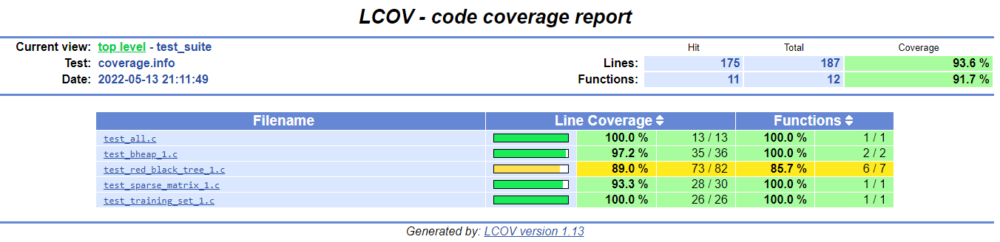

# Test Coverage

## Task Contributors
- Amani Brik
- Mehdi Moazami

## About gcov
Gcov is part of the GCC suite. There is no need to install it separately.

It's an integrated tool that helps with performing test code coverage. The next sections will specify the steps for running the gcov tool and the tests that were made by the team members.

## About lcov

Since gcov does not provide a lot of information by itself and is not very user-friendly, it is a good idea to use lcov alongside with it. lcov generates reports in html files. These files provide a lot more information about the code coverage of each file.

To install lcov, just run the following command:

`apt install lcov`

## Steps for running gcov

- **Step 1: Compile the files**

After running the docker image and building the program with the `make` command, run these command on the console.

-- To compile test_all.c

`gcc -fprofile-arcs -ftest-coverage test_suite/test_all.c test_suite/test_red_black_tree_1.c test_suite/test_bheap_1.c test_suite/test_sparse_matrix_1.c test_suite/test_training_set_1.c src/libRecommender.a -lm -o test_suite/test_all`

-- To compile test.c

`gcc -fprofile-arcs -ftest-coverage test/test.c src/recommender.c src/matrix_factorization.c src/matrix_factorization_bias.c src/sparse_matrix.c src/libRecommender.a -lm -o test/test`

-- To compile test_large_training_set.c

`gcc -fprofile-arcs -ftest-coverage test/test_large_training_set.c src/recommender.c src/matrix_factorization.c src/matrix_factorization_bias.c src/sparse_matrix.c src/libRecommender.a -lm -o test/test_large_training_set`

**Note:** These are just the commands that were used for this homework. They can be changed according to the test file and its dependencies.

- **Step 2: Running the test files**

Run the instrumented binary and perform functional testing.

-- To run test_all

`./test_suite/test_all`

-- To run test

`./test/test`

-- To run test_large_training_set

`./test/test_large_training_set`

Running the binary generates profile output. For each source file that you compiled with -fprofile-arcs, a .gcda profile output file is created in the object file directory.

- Step 3:

-- gcov on test_all.c

`gcov test_all.c`

-- gcov on test.c

`gcov test.c`

-- gcov on test_large_training_set.c

`gcov test_large_training_set.c`

Now you can open the created .c.gcov files and they will show you the lines that have been executed.

## Steps for running lcov

- Step 1:

Run all the gcov commands specified previously.

-Step 2:

Generate the coverage.info data file

`lcov --capture --directory . --output-file coverage.info`

-Step 3:

Generate a report from this data file

`genhtml coverage.info --output-directory out`

**Note:** This works for all files.

## RESULTS

**Conclusion:**

The .gcov file shows us that all the lines in the test_all.c file have been executed except the include lines and the variable declaration lines. This is normal and expected. The test_all.c file has no problems.

As we can see, this is not very user friendly and this is why se used lcov alongside with it. It turns out that the test_suite file have an overall good code coverage whereas the src files don't. This means that we are not testing all of the written code and we could write more tests to have better code coverage.